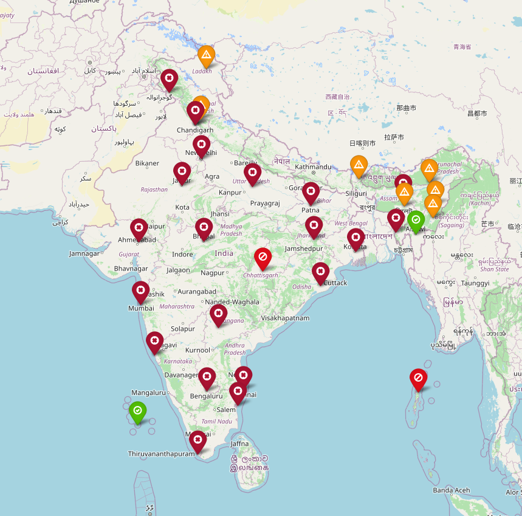

# How to Use

- Clone the project

- run ```pip install -r requirements.txt```

- ```python3 main.py```

- It will launch a google-chrome tab showing the map, if you dont have chrome installed open the generated `map.html` with any browser.


--------------------------------------------------------------------------------------------------------------------





This project visualises the current COVID position of India on a map using Folium

Hover over the markers and click it :p

(will extend it to more countries later)
