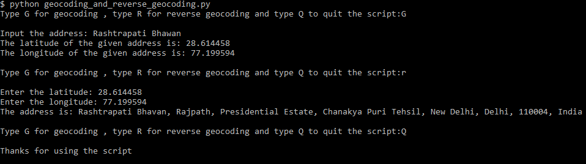

### Geocoding and Reverse Geocoding 

#### This script takes an address and return its latitude and longitude.This process is called geocoding
#### It can also perform the opposite operation that is take latitude, longitude and provide address.

#### I have used the LocationIQ website's geocoding api inorder to solve this problem.

#### In order to run this script you need to have a private token which is just a key for the api..

#### To obtain your own private token create a *free account* at https://locationiq.com/ and replace my private token with yours.

#### Remember, *don't share* your private token with anyone if you use your personal email for account creation.

#### Install the dependencies by using:

pip install -r requirements.txt

#### An Example of the script in action:

