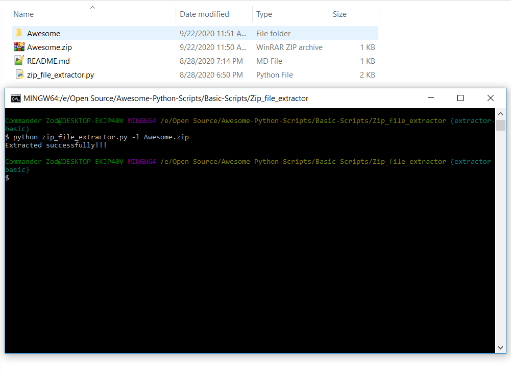

## Extract zip files

This script takes a zip file as input and extracts its content into a separate folder.
The folder is named same as the input zip file and is saved in the current directory

### How to use this?
Just type the following in the command prompt:

python zip_file_extractor.py -l <Your zip file>

Example: 

python zip_file_extractor.py -l Awesome.zip

	

