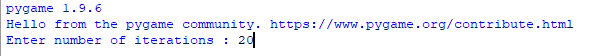
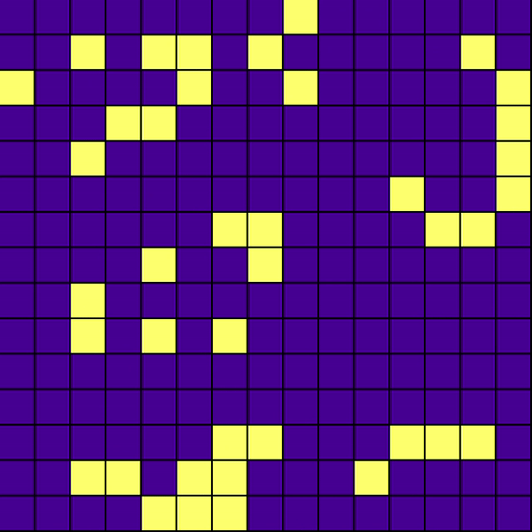

## Conway's Game of Life ##

- John Conway was a famous mathematician, he developed the Game of Life.
- Game of Life is a cellular automation

## Description ##

- These are the rules of the game :
    - For a space that is 'populated':
        Each cell with one or no neighbors dies, as if by solitude.
        Each cell with four or more neighbors dies, as if by overpopulation.
        Each cell with two or three neighbors survives.
    - For a space that is 'empty' or 'unpopulated'
    - Each cell with three neighbors becomes populated.

- This game is simulated accordingly in PyGame.

## Working ##

- The user is prompted to enter the number of iterations the simulation should run 

- The PyGame module runs for the given number of iterations as shown

## Requirements ##
- Pygame module
- numpy
