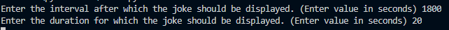
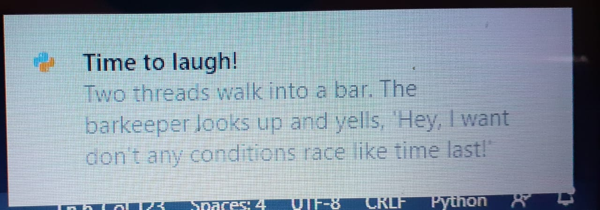

# Desktop notifier
- This script is exclusive to Windows
- This script displays a randomly generated joke by the PyJokes library.
- The user can set :
- The interval at which the joke is displayed.
- The duration for which the notification exists.

## Working
- pip install pyjokes
- pip install wintoast
- This script can be run by the command : python3 display_jokes.py

