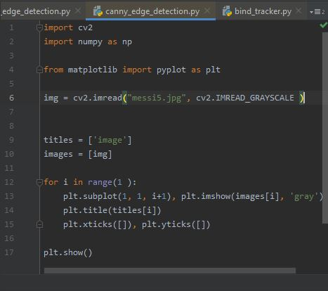
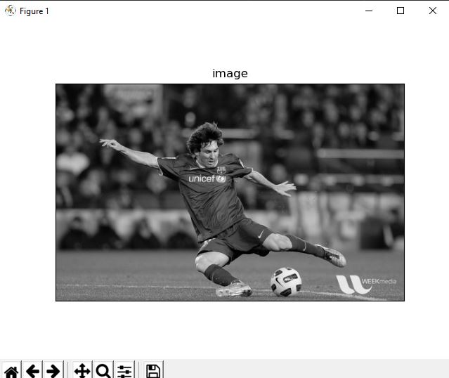
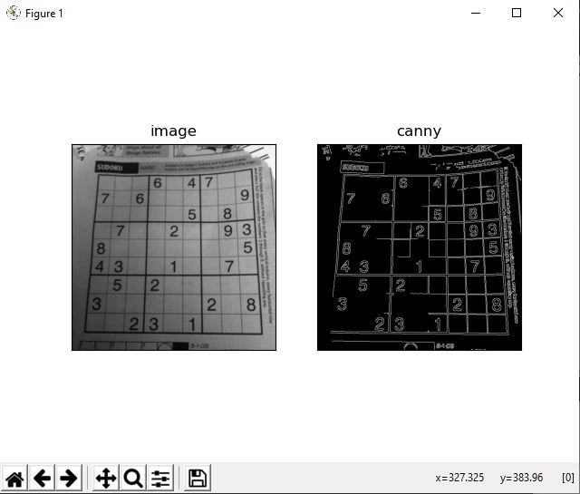

# Canny Edge detection using OpenCV and python

## What is Canny Edge Detection?

> It is an edge detection operator that uses a multi-stage algorithm to detect a wide range of edges in images.
  It was developed by John F. Canny ,an Australian computer scientist, back in 1986.

### _The Canny edge detection algorithm is composed of 5 steps_:
+ Noise reduction;
+ Gradient calculation;
+ Non-maximum suppression;
+ Double threshold;
+ Edge Tracking by Hysteresis.

## Lets see how it's done.

   

   
   

1. ### Input image:  
    Input in RGB format.  
    

    
    

2. ### Converting the image to grayscale:
   For easier calculations.  
   

   
   

3. ### Smoothing the image:  
   Smoothing of image for noise reduction. Gradient is the first order derivatives of image for each direction.
   It is cause of edges that seems more and the edges look thick.  
   

   
   

        
4. ### Image gradient:  
   Gradient is the function of the partial derivatives. I applied to the image convolution process with Sobel filters to obtain this partial derivative.
   

   
   

5. ### Non-maximum suppression:  
   In this step the pixel is compared with its two neighbors of the pixel, if the compared pixel is larger than neighbor we do not change the pixel,
   otherwise, this pixel is not maximum value hence, we set the zero to that pixel.

6. ### Tracking the edge by hysteresis:  
   In this step we choose two type of threshold, high and low threshold value. Afterward, each pixel of image is compared with two different threshold value.
   If the pixel is larger than the high threshold, this pixel mark with 255 in the final image.
   If the pixel between high threshold and low threshold. If the pixel is smaller than low-threshold image, mark as black with 0 (black) value in the resulting image.  
   
7. ### Final Results:  
   After passing all of the mentioned steps, we will give the final result from the method.
   
# Output Results:

   

   
   
  
   

## Endnote: 
### **For more detail on learning Canny Edge Detection and maths behind, see my article** [here](https://medium.com/simply-dev/what-is-canny-edge-detection-cfefa272a8d0)
