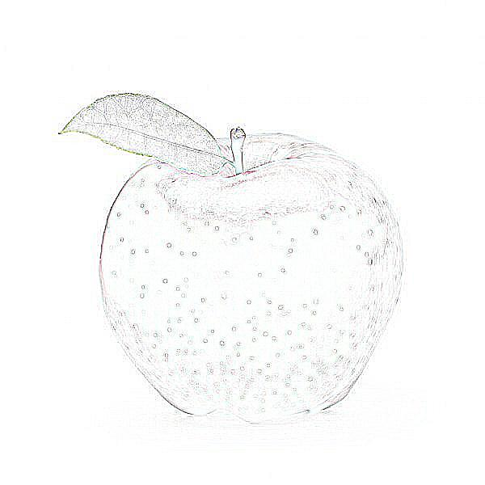
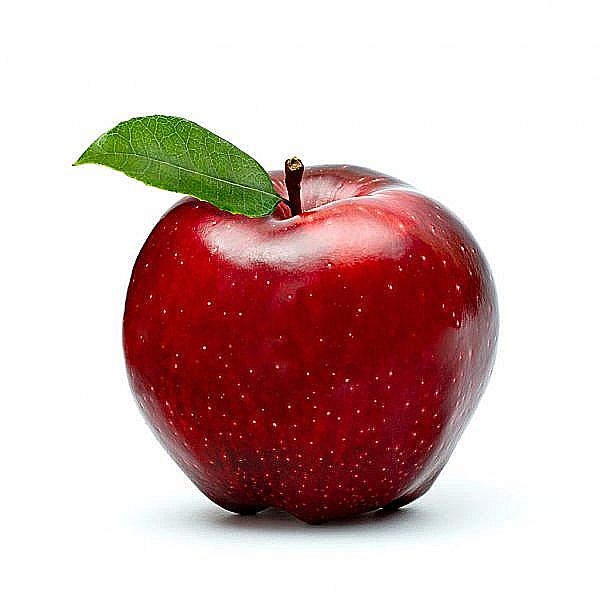
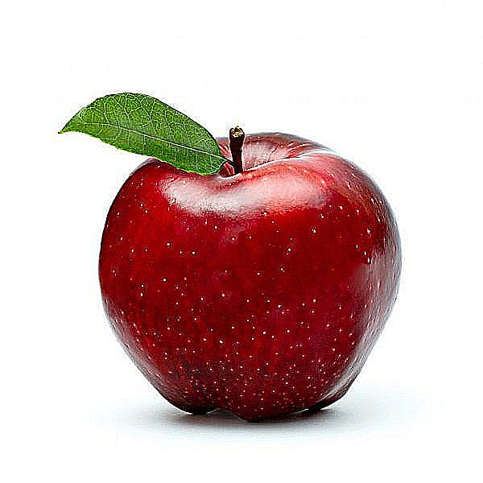
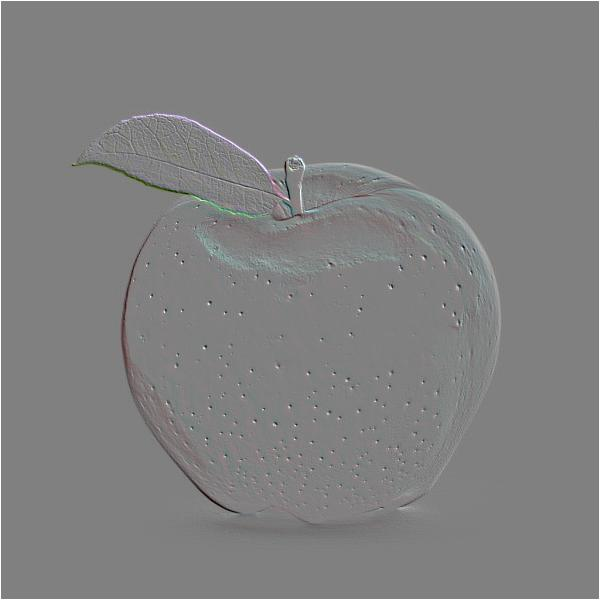
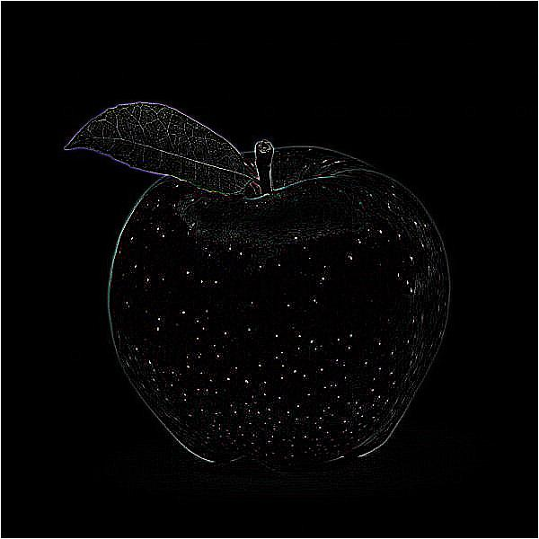
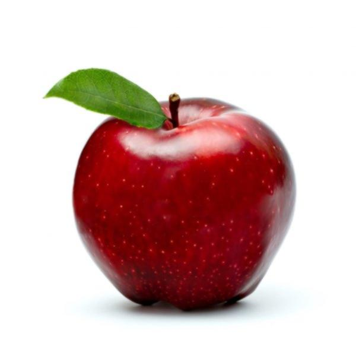
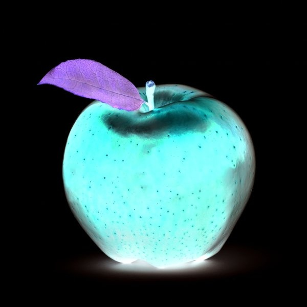

# Multi Filters Include Negative

The multi filters provides eleven differents filters to apply on images. It includes the Blur effect, Contour, Detail, Edge enhance and the Edge enhance more, Emboss, Find_egdes, Sharpen, Smooth and the Smooth_more and the Negative effect

## Installing dependences

First of all, we should check if we are using an updated version of pip, with this line:

    `python3 -m pip install --upgrade pip`

Now, we need to install Pillow library to support images on Python:

    `python3 -m pip install --upgrade Pillow`

Then, the opencv library help us with computer vision, providing us with functions to apply filters:

    `pip install opencv-python`

Others dependences that we are going to need are matplotlib, to display the images and for that we need to install numpy:

    `pip install numpy`

and then install matplotlib:

    `matplotlib: python -m pip install -U matplotlib`

note that matplotlib may install numpy as a dependence, but is a good practice to do it manually

## Running

To get the program running we use the command below:

    `python filters.py [NAME OF FILE IMAGE]`

It will show us the image we chosen and open a menu with the filters, from which we got to write a number corresponding to the filter we would like

## Example

Let's try out with a normal image of an apple

  

Applying each of the filters, we get the following results:

1 - Blur filter

  

2 - Contour filter

  

3 - Detail filter

  

4 - Edge enhance filter

  

5 - Edge enhance more filter

  

6 - Emboss filter

  

7 - Find_egdes filter

  

8 - Sharpen filter

  

9 - Smooth filter

  

10 - Smooth_more filter

  

11 - Negative filter

  

