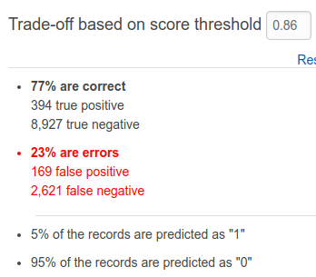

# Bank Marketing
The data is related with direct marketing campaigns (phone calls) of a Portuguese banking institution. You can find the data [here](http://archive.ics.uci.edu/ml/machine-learning-databases/00222/bank-additional.zip). Trying to classify it with different frameworks & platforms, and trying to compare the results.

In this repository I am focusing on how to use Amazon ML from your local machine. If you want to use the GUI, follow these 10 simple steps: 
1. Go to [aws](https://aws.amazon.com/).
2. Sign in to the Console
3. Set region as either US East(Virginia) or EU (Ireland)
4. Save dataset in a S3 Bucket or Amazon Redshift cluster.
5. Click on services -> Machine Learning
6. If you do not have any previously created ML model, click -> Get Started.
7. Standard Setup -> Launch
8. Enter bucket name and datasource name(optional).
9. Create the Data Schema 
10. Enter target variable from your dataset.
11. Review your datasource info.
 
When I used Amazon ML I go this result 

More the number of False positive, more the loss incurred by the organization.
