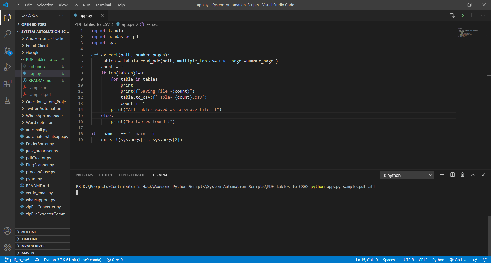

# PDF to CSV
This script will convert the tables in the PDF file into CSV files. Each CSV file has one table from the PDF and the number of CSV equal to the number of tables in the PDF.

# Requirements
`pip install tabula-py, pandas`

# How to use?
Just use the following command while executing the scrpit:

`python app.py location_of_pdf pages`

Pages have two options:
- 'all' will extract tables from whole PDF
- specific page (ex 1,2,54..) will extract table from that page

Example:
- `python app.py sample.pdf all`
- `python app.py sample2.pdf 45`

# Preview

