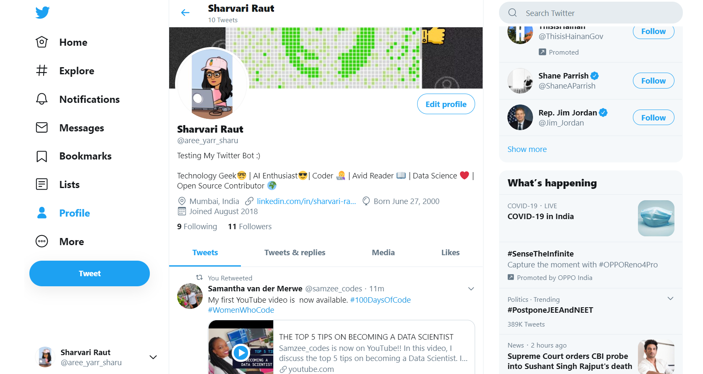

<h1>Twitter Automation Code</h1>
<h3>Pre-requisites:</h3>
-Must have a Twitter account and Twitter developer account. 
-Need to add your access keys to use twitter APIs 

<h3>Working:</h3>
Just run it and it will like and retweet tweets of the value which you have assigned to the "search".

<h3>Voila!!! Twitter Is Automated</h3>

  

