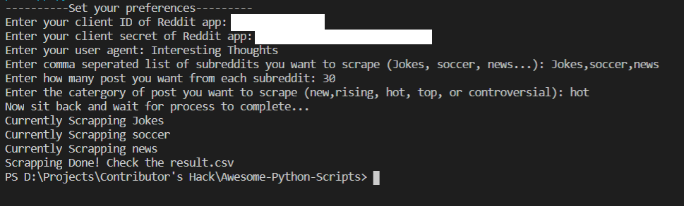
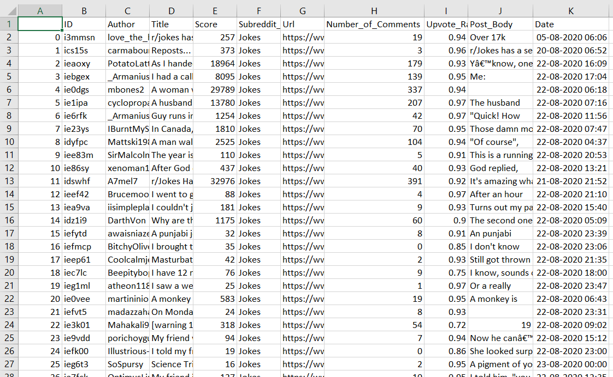

# Reddit Data Scrapper
This script will fetch the details of the Subreddit using Reddit API. You can define number of post you want to grab from each subreddit, the type of post you want: New ,Rising, Hot, Top, or Controversial, and the subreddits from which want details. The following details will be scrapped from each post: 'ID', 'Author', 'Title', 'Score', 'Subreddit_Name', 'Url', 'Number_of_Comments', 'Upvote_Ratio', 'Post_Body', 'Date'.

# How to run?
Run the command: 

```python app.py```

and follow the on-screen instructions

# Pre-requestes:
Run this command:

```pip install requirements.txt```

# Working Demo:
On configuring the following things:



The output csv looks like this:



