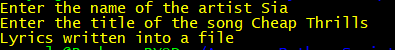

## Song Lyrics ##

- This script can be used to get the lyrics of any english song using web scraping
- The libraries BeautifulSoup, urllib and re are used

## Working ##

- The user is prompted to enter the name of the artist and the name of the song
- If the input data is valid, the page is scraped and the lyrics of the song are written into a file, else an error message is returned

